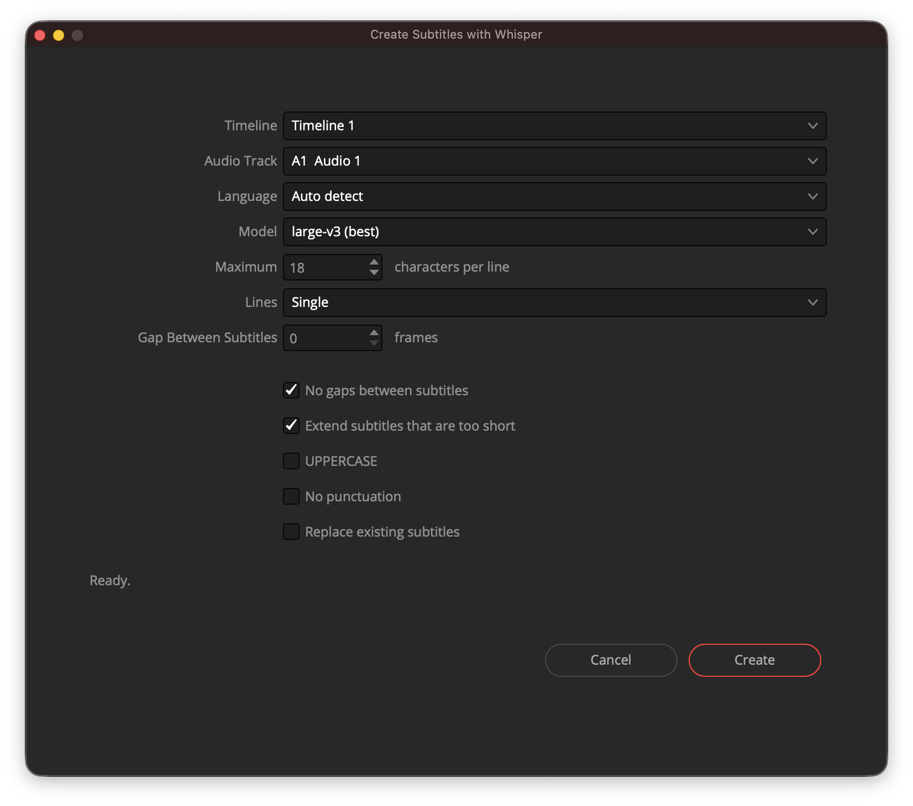

# Whisper Subtitles for DaVinci Resolve

Subtitles generated by Whisper, inside Resolve, with **short lines broken where a human
would break them**. Built for vertical video, where a line has to fit in 18 characters and
a bad break is glaring.



Press Create and the subtitles land on the Subtitle 1 track of your timeline. No files to
manage, no round trip through an external app.

## Why not the built-in one

Resolve's "Create Subtitles from Audio" wraps text by counting characters. At 18 characters
per line that produces breaks like this:

```
il benessere della        Se anche tu vuoi
pelle o supportare        provare, ti lascio
```

A line ending on `della` leaves the reader hanging on a preposition. This plugin uses
Whisper's per-word timestamps and decides where to break from punctuation, real pauses in
the audio, and grammar:

```
il benessere              Se anche tu
della pelle               vuoi provare,
```

## What it does differently

- **It transcribes the voice, not the mix.** You pick the audio track; the plugin reads its
  clips and rebuilds them with ffmpeg into a timeline-aligned WAV. Whisper never hears the
  music, and the timings map 1:1 onto the timeline even when the voice-over is cut into
  twenty pieces. It is also about 3x faster than feeding it a full mixdown.
- **A line never ends on a word that governs the next one** - articles, prepositions,
  conjunctions, auxiliaries, negations, elisions. Word lists ship for it, en, es, fr, de, pt.
- **Balanced lines.** Two-line subtitles come out roughly even, not `17 + 3`.
- **No flashes, no holes.** Subtitles too short to read borrow time from the next one;
  optionally each subtitle stays up until the next one starts, so the timeline has no gaps.

## Install

macOS with DaVinci Resolve (Free or Studio), Python 3.9+, and ffmpeg.

```bash
git clone https://github.com/rinste/davinci-whisper-subtitles.git
cd davinci-whisper-subtitles
./install.sh
```

The installer checks the prerequisites, creates a virtualenv here, and symlinks the plugin
into Resolve's Scripts folder. Then, in Resolve:

1. **Preferences > System > General**: set *External scripting using* to **Local**
2. **Workspace > Scripts > Utility > Whisper Subtitles**

The first run downloads the Whisper model (~3 GB for `large-v3`, less for the smaller ones)
and caches it. Nothing leaves your machine: transcription runs locally.

To remove it: `./install.sh --uninstall`

## Settings

| | |
|---|---|
| **Timeline** | which timeline to work on, preselected to the one you have open |
| **Audio Track** | the track holding the voice - not the mix |
| **Language** | auto-detect, or force it (more reliable on short clips) |
| **Model** | `large-v3` is the best; `turbo` and the smaller ones trade accuracy for speed |
| **Maximum characters per line** | 18 suits vertical video. Below 14, many words are longer than the limit on their own |
| **Lines** | `Single` for vertical, `Double` for the classic two-line format |
| **Gap Between Subtitles** | in frames, ignored when *No gaps* is on |
| **No gaps between subtitles** | each subtitle stays up until the next one starts |
| **Extend subtitles that are too short** | lengthens the unreadable flashes by borrowing from the next subtitle |
| **UPPERCASE**, **No punctuation** | the usual social-video styling |
| **Replace existing subtitles** | required if Subtitle 1 is not empty - see below |

Subtitles always go to **Subtitle 1**, because that is where Resolve's API puts them, and
they are *appended* to whatever is already there. So if that track is occupied the plugin
stops immediately and asks you to tick *Replace existing subtitles*, rather than stacking
copies on top of your work.

## Command line

The engine is a standalone script; the plugin is a front end for it.

```bash
.venv/bin/python whisper_srt.py audio.m4a -m large-v3 -l it --max-lines 1 -c 18 \
    --stretch-short --fill-gaps
```

Transcribing is the slow part. Save the word timings once and re-split them for free:

```bash
.venv/bin/python whisper_srt.py audio.m4a --words-json words.json -c 18
.venv/bin/python whisper_srt.py --from-json words.json -c 14 --max-lines 1 -o short.srt
```

`--help` lists everything. It also has a `--backend wavespeed` mode that runs Whisper
large-v3 in the cloud with no local install; note that the endpoint only returns
per-segment timestamps, so the per-word timings are estimated and the sync is looser.

## How the line breaking works

Whisper gives a timestamp for every word. From there:

1. **Closing a subtitle.** At the end of a sentence, at a real pause in the audio, at the
   maximum duration, or when no more text fits. In that last case it can *back up* a few
   words if there was a better break point just before - a comma, the end of a clause.
2. **Laying out the lines.** Dynamic programming over a cost function: even line lengths, a
   bonus for breaking after punctuation, a heavy penalty for a line that would end on a word
   governing the next one.
3. **Fixing the timings.** Minimum duration, no overlaps, a frame of separation - or none at
   all with *No gaps*.

Each run prints a summary: number of subtitles, longest line, shortest duration, peak
characters per second. Above ~20 chars/s the text is hard to read; below ~0.4 s it flashes.

## Notes for anyone hacking on this

Behaviours of Resolve's scripting API found the hard way, none of them documented:

- `MediaPool.AppendToTimeline` with `trackIndex` or `recordFrame` appends the subtitles at
  the **end of the timeline** instead of aligning them. With `mediaPoolItem` alone they line
  up correctly. It also always writes to Subtitle 1, whatever you pass.
- `MediaPool.ImportMedia` silently returns `None` for a path it has already imported, so
  every run writes its SRT to a fresh temporary folder.
- There is no SRT import/export on the timeline: `ImportIntoTimeline` only takes AAF.
- Resolve launches scripts with an **ASCII locale**. `subprocess` with `text=True` blows up
  on the first accented character, and even a plain `print` can fail. Reproduce it with
  `LC_ALL=C LANG=C PYTHONCOERCECLOCALE=0 PYTHONUTF8=0` - from a normal terminal the bug is
  invisible.
- Fusion **swallows exceptions raised inside event handlers**, which is why everything is
  logged to `~/whisper_subtitles.log`.
- `disp.StepLoop()` does not exist in this build (`KeyError: 'On'`).
- For a **fixed-size window**, `MinimumSize`/`MaximumSize` in the `AddWindow` dict land on
  the content and the frame stays draggable. They have to be set as attributes on the
  window, after `Show()`.
- Fusion widgets do not shrink below the width of their own content and the layout adds
  spacing of its own, so rows need slack or the last widget on each row gets clipped.
- `ui.FindWindow(ID)` is a reliable liveness check for enforcing a single window: it finds
  the window while the script that created it is running, and returns `None` once it ends.

## Licence

MIT. Whisper is by OpenAI; [faster-whisper](https://github.com/SYSTRAN/faster-whisper) does
the heavy lifting.
